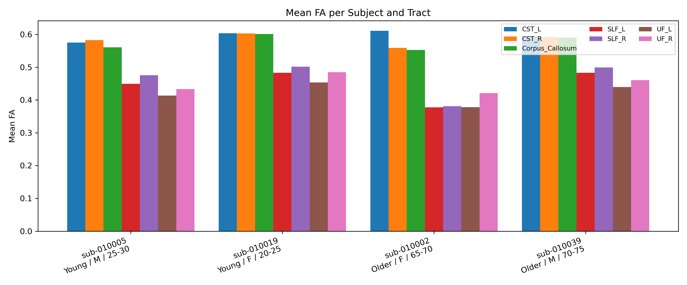
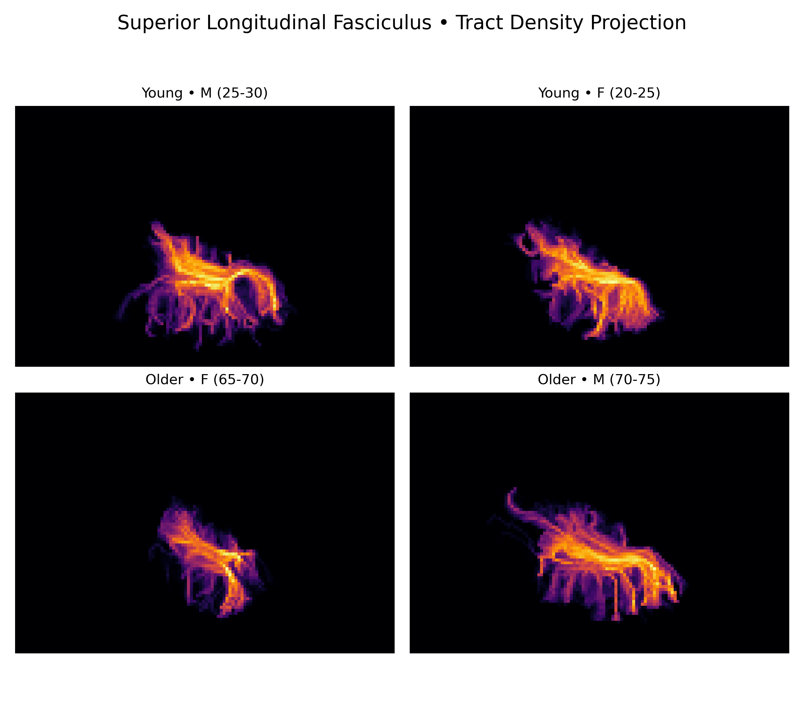

# 노화에 따른 백질 변화: Diffusion MRI 분석

**연구 질문**: 노화에 따라 백질 구조가 어떻게 변화하는가?

**방법**:  
OpenNeuro ds000221의 젊은 성인(25세)과 노인(70세) diffusion MRI 데이터를 비교했습니다. Corpus Callosum, Superior Longitudinal Fasciculus(SLF), Corticospinal Tract(CST)에서 fractional anisotropy(FA)를 측정하고, 백질 경로를 시각화하기 위해 tractography를 수행했습니다.

**주요 발견**:  
노화 군에서 SLF FA가 젊은 군 대비 평균 약 8–10 % 감소하여 분석한 tract 중 가장 큰 연령 차이를 보였습니다.

**그림**:  

**해석**:  
SLF FA 감소와 Corpus Callosum streamline 축소(약 −15 %)는 장거리 association fibers에서 탈수초화와 축삭 손실이 동시에 진행되고 있음을 시사합니다. CST FA는 상대적으로 안정적이어서 주요 운동 투사섬유는 보존되지만, SLF 저하는 전두-두정 언어·주의 네트워크 효율을 떨어뜨려 언어 유창성, 선택적 주의, 작업기억의 노화 관련 둔화를 설명할 수 있습니다. 따라서 노화는 고차 인지 네트워크에 선택적으로 부담을 주는 백질 리모델링 패턴을 형성합니다.

**한 가지 한계점**:  
표본이 4명(연령·성별 2×2)으로 매우 작고 횡단 설계라 개인별 변화 추세를 확인할 수 없습니다.

**향후 방향**:  
연령대와 인지 평가가 포함된 대규모 종단 cohort에서 tract-specific FA, radial diffusivity, streamline 변화를 추적해 정상 노화와 병리적 노화의 기점을 정량화해야 합니다.

**핵심 Claude Code 질문**:  
어떤 tract-specific diffusion 피처 조합이 정상 범위를 벗어나는 시점을 포착해 병리적 노화를 조기에 구분해낼 수 있을까?
